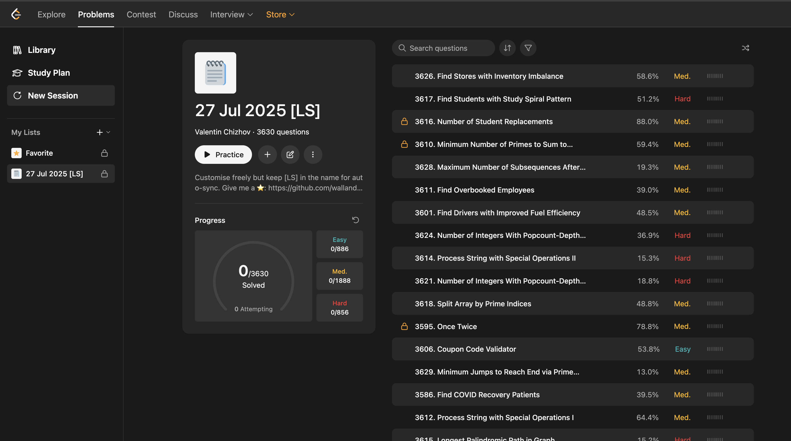

# LeetSession – Code obsession 🧠⚡️

Join the [Reddit discussion](https://www.reddit.com/r/leetcode/comments/1mbu6el/leetcode_removed_sessions_so_i_brought_them_back/)

> Userscript that **revives LeetCode’s removed “Session Management” workflow** by emulating a brand-new sessions: it creates a **self-updating favorite list containing every problem** while leaving all other lists and your global progress untouched.  
> **Works automatically on both** `leetcode.com/problemset/*` **and** `leetcode.com/problem-list/*` **pages.**
> **⭐️ If you find the script useful, please give the repo a star — it really helps!**
> 

## Table of Contents
1. [Why?](#why)
2. [Features](#features)
3. [Demo](#demo)
4. [Installation](#installation)
5. [Usage](#usage)
6. [How It Works](#how-it-works)
7. [FAQ / Troubleshooting](#faq--troubleshooting)
8. [Contributing](#contributing)
9. [License](#license)
10. [Acknowledgements](#acknowledgements)

## Why?

In **2024** LeetCode silently disabled **“Create”** button in Session Management section globally   
([issue #22883](https://github.com/LeetCode-Feedback/LeetCode-Feedback/issues/22883)).

**LeetSession** brings the feature back without touching LeetCode’s backend data:

* every click on **New Session** spawns a fresh private list that already contains **_all_ problems**;
* solved counters in that list are reset **only once** when creating a new session;
* the list auto-syncs daily, so brand-new problems appear automatically **without affecting your progress**;
* **your existing favorite lists and overall profile stats remain exactly as they were.**

## Features

- **One-click "New Session"** - Creates fresh problem list 
- **Auto-naming** - `DD MMM YYYY [LS]` format 
- **Complete problem set** - All 3600+ problems included 
- **Daily auto-sync** - Silent background updates 
- **Zero side effects** - Never touches other lists 
- **Interruption recovery** - Resumes if creation fails 
- **Rate limit handling** - Automatic retry with backoff 

## Demo

  

## Installation

> **Prerequisite:** a userscript manager such as Tampermonkey or Violentmonkey.

| Browser | Userscript Manager |
|---------|-------------------|
| Chrome / Edge / Brave | [Tampermonkey](https://tampermonkey.net/) |
| Firefox | [Violentmonkey](https://violentmonkey.github.io/) |

### Quick Install

1. Install the manager for your browser.  
2. Click **Install LeetSession** → [`leetsession.user.js`](https://raw.githubusercontent.com/wallandteen/leetsession/main/leetsession.user.js).  
3. Confirm the prompt in your userscript dashboard.  
4. Go to <https://leetcode.com/problemset> – the **New Session** button appears under **Study Plan** in the left bar.

#### Automatic Updates
The script defines an `@updateURL`, so your manager will fetch new versions automatically.

## Usage

* Click **New Session** whenever you want to start from scratch.  
* Keep the `[LS]` tag in the list name if you want daily auto-sync.

## How It Works

* Relies on GraphQL mutations accepted by LeetCode (`createEmptyFavorite`, `batchAddQuestionsToFavorite`, `resetFavoriteSessionV2`, `updateFavoriteNameDescriptionV2`).
* Operates **only** on lists that contain `[LS]`; other lists are never queried or modified.
* Stores the last sync date in `localStorage` and runs silently every 24 h.
* Detects interrupted creation (closed tab, crash) and resumes on the next visit.

## FAQ / Troubleshooting

How many sessions can I create?

**Unlimited.** Each click creates an independent list (`#1`, `#2`, …).

Can I rename a session or edit its description?

Yes. Keep the tag **`[LS]`** anywhere in the name to preserve auto-sync.

Can I remove some problems from the list?

You can, but if the name still contains **`[LS]`** the script will add every missing problem back during the next sync. Your progress (solved problems) will be preserved.

Button doesn’t show up

* Reload the page.
* Ensure the userscript manager is **Enabled**.    
* Check that no content blocker removes sidebar elements.

Stuck on “⏳ Creating session…”

You likely hit LeetCode’s rate limit (HTTP 429). Leave the tab open; the script retries automatically with exponential back-off.

What happens if I close the browser during creation?

The script detects incomplete sessions and automatically resumes creation on the next visit. Look for sessions with `[CREATING]` in the name.

Can I use this with multiple LeetCode accounts?

Yes, each account maintains its own sessions independently. The script only operates on lists containing `[LS]`.

How do I know if auto-sync is working?

Check the browser console for `[LeetSession]` logs. You'll see sync messages when new problems are added.

## Contributing

PRs are welcome! ⭐️

## License

[MIT](LICENSE) © 2025 Valentin Chizhov

## Acknowledgements

* LeetCode team for keeping the legacy mutations alive  
* Community discussion in [#22883](https://github.com/LeetCode-Feedback/LeetCode-Feedback/issues/22883) – inspiration for this script
